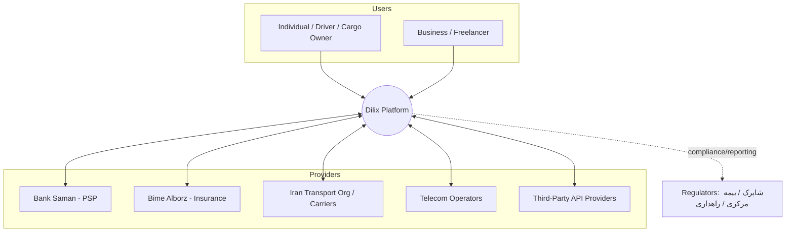
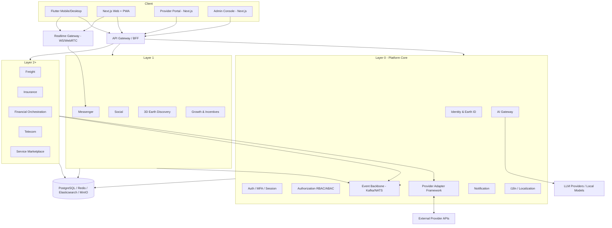
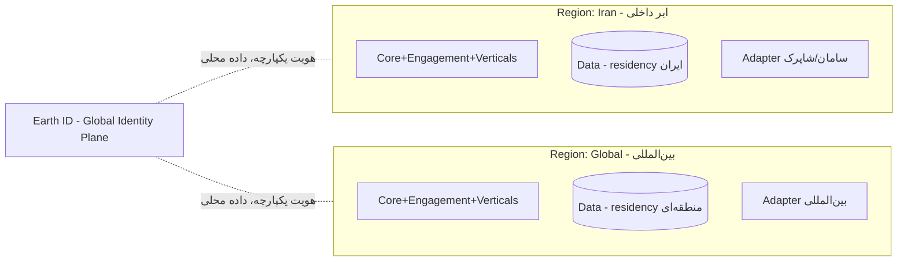
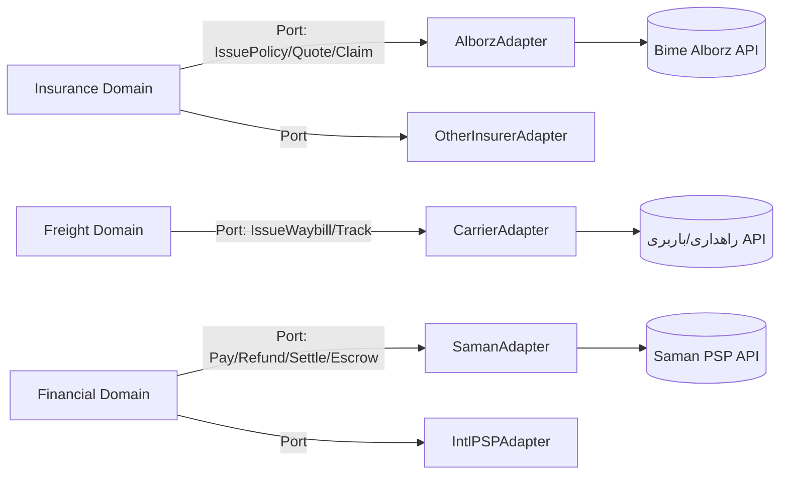
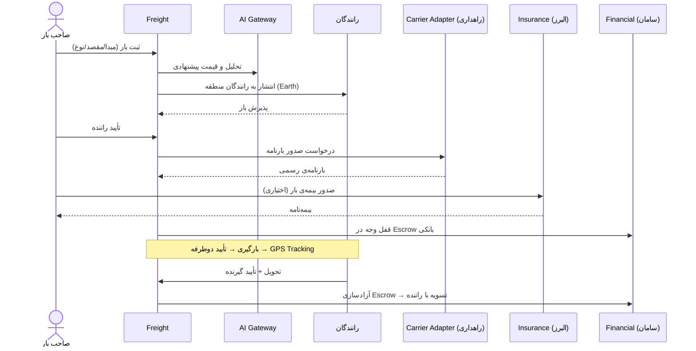

# سند ۱ — معماری سازمانی (Enterprise Architecture)
**فاز ۱** · Dilix v1.0

---

## ۱. چشم‌انداز معماری

Dilix یک پلتفرم چندوجهی (multi-sided platform) است با سه گروه ذی‌نفع:

1. **کاربران نهایی** (افراد، رانندگان، صاحبان بار، فریلنسرها).
2. **ارائه‌دهندگان خدمات** (بانک، بیمه، حمل‌ونقل، اپراتور، third-party).
3. **ناظران/ادمین‌ها** (Moderator، Regional/Country/Global Admin، رگولاتورها).

اصل معماری: **«هسته‌ی واسط + پلاگین‌های ارائه‌دهنده»**. هسته (Core) ثابت و امن است؛ ارائه‌دهندگان از طریق Adapterهای استاندارد متصل می‌شوند.

---

## ۲. نمای System Context (C4 — Level 1)

---

## ۳. نمای Container (C4 — Level 2)

---

## ۴. سبک معماری

- **API-First / Contract-First:** هر سرویس قبل از کد، OpenAPI (sync) و AsyncAPI (events) دارد.
- **Modular Monolith → Microservices تدریجی:** لایه ۰ و ۱ ابتدا به‌صورت چند سرویس درشت (Core، Engagement، Vertical) با مرزهای ماژولار داخلی؛ تفکیک به میکروسرویس وقتی scale واقعی ایجاب کند.
- **Event-Driven:** ارتباط بین Bounded Contextها از طریق رویداد (Kafka یا NATS JetStream). درخواست‌های همزمان از طریق API Gateway.
- **CQRS سبک** در ماژول‌های پرخواندن (Social feed, Earth discovery, Reputation) با Elasticsearch به‌عنوان read-model.
- **BFF (Backend-for-Frontend)** جدا برای Mobile، Web، Provider Portal، Admin.

---

## ۵. استراتژی Multi-Region / Hybrid

اصل **Data Residency**: داده‌ی شخصی هر کاربر در ریجن کشورش ذخیره می‌شود. فقط **شناسه و متادیتای هویتی حداقلی** (Earth ID Global Plane) بین‌ریجنی است. این هم‌زمان GDPR (اروپا)، قوانین داده‌ی ایران، و الزامات روسیه/عمان/ترکیه را پوشش می‌دهد.

---

## ۶. لایه‌بندی منطقی

| لایه | مسئولیت |
|---|---|
| **Experience** | Flutter, Next.js, PWA, Provider Portal, Admin |
| **Edge** | CDN, WAF, API Gateway, Realtime Gateway, Rate Limiting |
| **Application (Domain)** | Bounded Contextها (Core, Engagement, Verticals) |
| **Integration** | Provider Adapter Framework, Event Backbone, AI Gateway |
| **Data** | PostgreSQL, Redis, Elasticsearch, MinIO, Vector DB |
| **Platform/Infra** | Kubernetes, Service Mesh, Observability, Secrets |

---

## ۷. کیفیت‌های معماری (Non-Functional / Architecture Drivers)

| ویژگی | هدف baseline |
|---|---|
| Availability | 99.9% (Core/Messenger 99.95%) |
| Latency (API p95) | < 300ms داخل ریجن |
| Realtime delivery | < 1s تحویل پیام |
| Scalability | افقی؛ طراحی برای 10M+ MAU، 100k اتصال همزمان WS در فاز رشد |
| Data residency | per-region، قابل‌اثبات |
| Security | Zero Trust، E2EE برای پیام، audit کامل |
| Extensibility | افزودن ارائه‌دهنده‌ی جدید بدون تغییر هسته |
| Observability | Tracing (OpenTelemetry)، Metrics (Prometheus)، Logs ساختاریافته |

---

## ۸. Provider Adapter Framework (ستون فقرات)

هر ماژول vertical یک **Port** استاندارد تعریف می‌کند؛ هر ارائه‌دهنده یک **Adapter** که آن Port را پیاده می‌کند.

ویژگی‌ها:
- **Capability Registry:** هر Adapter قابلیت‌هایش را اعلام می‌کند (مثلاً «بیمه باربری»، «بیمه ثالث»).
- **Self-Registration + KYB:** ارائه‌دهنده از Provider Portal ثبت‌نام می‌کند، مدارک مجوز را آپلود می‌کند، در Sandbox تست، سپس approval.
- **Contract Versioning + Sandbox + Production keys.**
- **Resilience:** Circuit Breaker، Retry، Timeout، Idempotency برای هر فراخوانی بیرونی.

---

## ۹. جریان نمونه (Cross-Cutting) — اعلام بار تا تسویه

---

## ۱۰. ریسک‌های معماری و کاهش آن‌ها

| ریسک | اثر | کاهش |
|---|---|---|
| تحریم زیرساخت بین‌المللی | عدم دسترسی ایران | Hybrid، ابر داخلی، عدم وابستگی سخت به یک کلاد |
| Scope بزرگ | تأخیر/شکست | ساخت لایه‌ای، طراحی جامع/اجرای محدود |
| وابستگی به ارائه‌دهنده‌ی واحد | تک‌نقطه شکست | Adapter چندگانه + fallback |
| حریم‌خصوصی نقشه افراد | ریسک حقوقی/ایمنی | Opt-in + fuzzing + privacy-by-design |
| تناقض E2EE با AI | نقض رمزنگاری | مرزبندی صریح (سند ۶ و ۸) |
| رگولاتوری مالی/بیمه | توقف فعالیت | نقش «واسط»، وجه نزد بانک، کارگزاری بیمه |
