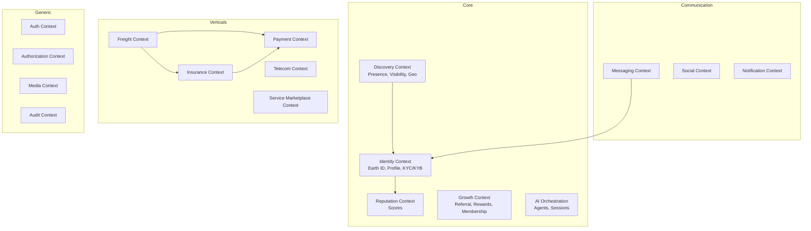
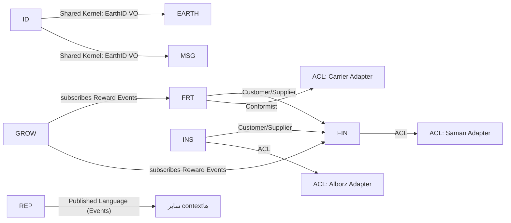

# سند ۲ — طراحی دامنه‌محور (Domain Driven Design)
**فاز ۲** · Dilix v1.0

---

## ۱. نقشه‌ی دامنه‌ها (Domain Map)

| نوع دامنه | دامنه‌ها |
|---|---|
| **Core (هسته‌ی رقابتی)** | Identity (Earth ID)، 3D Earth Discovery، Reputation، Growth & Incentives، AI Orchestration |
| **Supporting** | Messenger، Social، Service Marketplace، Notification |
| **Generic** | Auth، Authorization، File/Media، Localization، Audit |
| **Integration (واسط با مجوزدار)** | Freight، Insurance، Financial، Telecom، Open API |

---

## ۲. Bounded Contextها و زبان مشترک (Ubiquitous Language)

### نمونه واژگان مشترک
- **Earth ID:** شناسه‌ی جهانی یکتای هر موجودیت (شخص/کسب‌وکار/ارائه‌دهنده).
- **Presence:** وضعیت دیده‌شدن کاربر روی نقشه (opt-in، شعاع، مخاطب).
- **Provider:** ارائه‌دهنده‌ی خدمتِ دارای مجوز.
- **Waybill (بارنامه):** سند رسمی حمل که توسط Carrier مجاز صادر می‌شود.
- **Escrow Hold:** قفلِ وجه نزد بانک تا تکمیل تعهد.
- **Reward Event:** رویداد اقتصادی واقعی که پاداش به آن گره می‌خورد.

---

## ۳. Context Mapping (الگوهای ارتباط)

- **ACL (Anti-Corruption Layer):** هر Adapter بیرونی پشت ACL است تا مدل بیرونی به دامنه نشت نکند.
- **Published Language:** رویدادهای دامنه با schema نسخه‌دار (AsyncAPI) منتشر می‌شوند.

---

## ۴. Aggregateها (نمونه‌ی کلیدی)

### Identity Context
- **EarthIdentity** (Aggregate Root): `EarthId`, `type`, `status`, `kycLevel`
  - Entities: `Profile`, `ProfessionalProfile`, `VisibilitySettings`
  - VO: `EarthId`, `GeoPoint`, `VerificationLevel`
  - Invariant: تغییر `kycLevel` فقط با مدرک تأییدشده.

### Freight Context
- **Shipment** (Aggregate Root): `shipmentId`, `route`, `cargo`, `status`
  - Entities: `Bid`, `AssignmentConfirmation`, `WaybillRef`, `TrackingSession`
  - VO: `Route(origin,destination)`, `CargoSpec`, `Money`
  - Invariant: انتقال به `PickedUp` فقط با تأیید دوطرفه (صاحب بار/نماینده + راننده).
  - Invariant: `Settlement` فقط پس از `Delivered` + تأیید گیرنده.

### Insurance Context
- **PolicyApplication** (Aggregate Root): `applicationId`, `type`, `quote`, `status`
  - Invariant: صدور (`Issued`) فقط با پاسخ تأیید از Adapter بیمه‌گر مجاز.

### Payment Context
- **PaymentOrder** (Aggregate Root): `orderId`, `amount`, `escrowState`
  - Invariant: Dilix هرگز وضعیت `Funds Held` را داخلی نگه نمی‌دارد؛ فقط رفرنس Escrow بانکی.

### Growth Context
- **RewardLedgerEntry** (Aggregate Root): `entryId`, `rewardEventRef`, `amount`, `level`
  - Invariant: هر پاداش باید به یک `Reward Event` با تراکنش واقعی گره بخورد (no recruitment-only reward).
  - Invariant: عمق رفرال ≤ ۳ و سقف پاداش هر سطح اعمال شود.

---

## ۵. رویدادهای دامنه (Domain Events — Event Storming خلاصه)

| Context | رویداد |
|---|---|
| Identity | `EarthIdRegistered`, `KycVerified`, `VisibilityChanged` |
| Discovery | `PresencePublished`, `DiscoveryContactRequested` |
| Messaging | `MessageSent`, `CallStarted` |
| Social | `PostPublished`, `StoryPublished`, `LiveStarted` |
| Freight | `ShipmentPosted`, `BidPlaced`, `DriverAssigned`, `PickupConfirmed`, `Delivered` |
| Insurance | `QuoteRequested`, `PolicyIssued`, `ClaimFiled` |
| Payment | `EscrowHeld`, `EscrowReleased`, `Settled`, `Refunded` |
| Reputation | `ScoreRecalculated` |
| Growth | `RewardEarned`, `ReferralActivated` |

---

## ۶. نگاشت دامنه ↔ سرویس (پیش‌نمایش فاز ۴)

هر Bounded Context = یک ماژول مستقل (در Modular Monolith) که بعداً می‌تواند به سرویس مستقل تبدیل شود. مرز تراکنش = مرز Aggregate. ارتباط بین‌Context فقط از طریق رویداد یا API عمومی، نه دسترسی مستقیم به دیتابیس دیگری.
