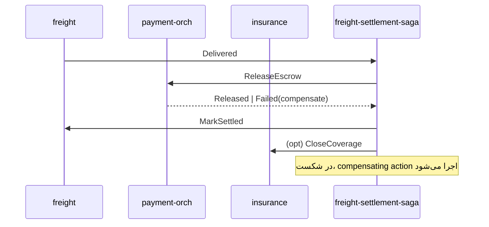

# سند ۴ — طراحی میکروسرویس‌ها (Microservice / Service Design)
**فاز ۴** · Dilix v1.0

---

## ۱. استراتژی تفکیک (ADR-03)

شروع با **Modular Monolith** در سه deployable درشت + سرویس‌های زیرساختی مستقل. هر ماژول داخلی مرز ماژولار سفت دارد تا تفکیک بعدی به میکروسرویس بدون بازنویسی ممکن باشد.

```mermaid
graph TB
    subgraph Deployables [فاز شروع]
      CORE[core-service\n(Identity, Auth, Authz, Provider, Notification, i18n)]
      ENG[engagement-service\n(Messaging, Social, Discovery, Growth, Reputation)]
      VERT[verticals-service\n(Freight, Insurance, Payment-orch, Telecom, ServiceMkt)]
    end
    subgraph Independent [مستقل از روز اول]
      GW[api-gateway / bff]
      RTGW[realtime-gateway (WS/WebRTC SFU)]
      AIGW[ai-gateway (LangGraph runtime)]
      WORKER[event-workers]
    end
    GW --> CORE & ENG & VERT
    RTGW --> ENG
    AIGW --> ENG & VERT
    WORKER -. consume events .- CORE & ENG & VERT
```

علت مستقل بودن RTGW و AIGW از ابتدا: پروفایل scale و runtime کاملاً متفاوت (اتصالات بلندمدت WS/WebRTC؛ بار GPU/LLM).

---

## ۲. مسیر تفکیک تدریجی (Evolution)

| مرحله | trigger | تفکیک |
|---|---|---|
| 0 | شروع | core / engagement / verticals + gateway + realtime + ai |
| 1 | بار پیام‌رسان | جداسازی `messaging-service` |
| 2 | حجم بار/حمل | جداسازی `freight-service` |
| 3 | بار feed/discovery | جداسازی `social-service` و `discovery-service` |
| 4 | تعدد ارائه‌دهنده | جداسازی `payment-orch`, `insurance-svc`, هر Adapter جدا |

---

## ۳. فهرست سرویس‌ها و مسئولیت

| سرویس | مسئولیت | DB | sync/async |
|---|---|---|---|
| api-gateway | routing, auth check, rate-limit, BFF | — | sync |
| realtime-gateway | WS presence/typing/receipts, WebRTC signaling+SFU | Redis | ws |
| identity | Earth ID, profile, KYC/KYB | pg:identity | both |
| auth | login, MFA, sessions, device keys | pg:auth, redis | sync |
| authorization | RBAC/ABAC policy decisions (PDP) | pg:authz | sync |
| provider | self-registration, KYB, API registry, sandbox | pg:provider | both |
| notification | push/email/sms/in-app | pg:notif | async |
| messaging | conversations, E2EE message store, receipts | pg:msg | both |
| social | posts/stories/reels/live, comments, feed | pg:social, es | both |
| discovery | presence, geo search, 3D earth queries | redis-geo, es | sync |
| growth | referral, rewards, membership, revenue-share | pg:growth | async |
| reputation | score aggregation | pg:rep | async |
| freight | shipment lifecycle, bidding, tracking | pg:freight | both |
| insurance | quote/issue/claim via Adapter | pg:ins | both |
| payment-orch | escrow/settlement orchestration via PSP | pg:pay | both |
| telecom | eSIM/plans via operator Adapter | pg:tel | both |
| service-mkt | freelance/services marketplace | pg:svc | both |
| ai-gateway | multi-agent orchestration, RAG, MCP | pg:ai, vector | both |
| event-workers | projections, sagas, reward calc | — | async |

---

## ۴. الگوهای ارتباطی

- **Sync:** REST/JSON پشت Gateway؛ gRPC برای ارتباط داخلی سرویس‌ها (در مرحله‌ی تفکیک).
- **Async:** Event Backbone (Kafka یا NATS JetStream) با schema registry (AsyncAPI).
- **Saga (Orchestration)** برای جریان‌های چندسرویسی مثل Freight settlement:



---

## ۵. الگوهای انعطاف‌پذیری (Resilience)

- **Outbox Pattern** برای انتشار رویداد اتمیک با تراکنش DB.
- **Idempotency Key** اجباری روی payment و provider calls.
- **Circuit Breaker / Retry / Timeout / Bulkhead** روی هر Adapter بیرونی.
- **Saga compensation** برای تراکنش‌های توزیع‌شده (بدون 2PC).
- **Dead Letter Queue** برای رویدادهای ناموفق.

---

## ۶. مرزهای داده و مالکیت

هر سرویس فقط دیتابیس خودش را می‌نویسد/می‌خواند. read-model مشترک (مثل feed/discovery) از طریق projection در Elasticsearch از روی رویدادها ساخته می‌شود (CQRS سبک).

---

## ۷. زیرساخت اجرا

- **Kubernetes** + Service Mesh (Istio/Linkerd) برای mTLS، traffic policy، canary.
- **Horizontal Pod Autoscaler** بر اساس CPU + custom metrics (طول صف، اتصالات WS).
- **Ingress + WAF + CDN** در لبه.
- **Per-region cluster** (Iran / Global) با همان مانیفست‌ها (GitOps).
- **Observability:** OpenTelemetry tracing، Prometheus/Grafana، Loki logs.

> یادآوری اجرایی: بیلدهای سنگین (Docker image build، گرَدل/کارگو/SDK) طبق سیاست پروژه فقط روی سرور SSH انجام می‌شوند، نه داخل کانتینر توسعه.
