# سند ۷ — طراحی UI/UX
**فاز ۷** · Dilix v1.0

---

## ۱. اصول طراحی

- **Super-App Shell:** یک پوسته‌ی واحد با ناوبری ماژولار (mini-apps داخل shell).
- **Mobile-first** (Flutter) + Web/PWA (Next.js).
- **RTL/LTR کامل** و چندزبانه از روز اول: fa (RTL), ar (RTL), en, ru, tr.
- **Privacy-first UX:** کنترل دیده‌شدن همیشه در دسترس و شفاف.
- **Accessibility:** WCAG 2.1 AA، تقویم شمسی و اعداد فارسی برای کاربر ایرانی.

---

## ۲. معماری اطلاعات (Navigation)

```
Bottom Nav (5):
  1) خانه/فید (Social)
  2) نقشه‌ی زمین (3D Earth Discovery)
  3) پیام‌ها (Messenger)
  4) خدمات (Freight / Insurance / Telecom / Marketplace)  ← هاب verticalها
  5) من (Earth ID / کیف پاداش / تنظیمات حریم خصوصی)

دستیار AI: دکمه‌ی شناور سراسری (در همه‌ی صفحات)
```

---

## ۳. تجربه‌ی نقشه‌ی سه‌بعدی (امضای محصول)

```mermaid
graph TB
    Globe[کره‌ی 3D - CesiumJS/Mapbox] --> Zoom[زوم: کشور → شهر → منطقه]
    Zoom --> Filters[فیلترها: نوع، شغل، زبان، سن، جنسیت*، تأهل*]
    Filters --> Pins[پین‌ها در سطح منطقه (fuzzed)]
    Pins --> Card[کارت پروفایل/پنل شغلی]
    Card --> Action[درخواست گفتگو / مشاهده پیج]
```

- زوم تدریجی روی کره؛ خوشه‌بندی (clustering) پین‌ها برای کارایی.
- **فیلدهای شخصی (جنسیت/تأهل/سن) فقط برای کاربرانِ opt-in نمایش داده می‌شوند.**
- پین افراد عادی در سطح **منطقه** (fuzzed)، نه نقطه‌ی دقیق؛ کسب‌وکارها می‌توانند دقیق باشند.
- لایه‌ی دوم نقشه: **ردیابی زنده‌ی بار (GPS)** برای صاحب بار.
- نشان/بلد برای جزئیات داخل ایران، Cesium/Mapbox برای نمای جهانی.

---

## ۴. صفحات کلیدی هر ماژول

| ماژول | صفحات کلیدی |
|---|---|
| Social | فید، استوری/ریلز، لایو، کامنت، پیج کسب‌وکار |
| Messenger | لیست گفتگو، چت (E2EE badge)، تماس صوتی/تصویری، چت AI (جدا و مشخص) |
| Earth | کره‌ی 3D، فیلتر، کارت پروفایل، تنظیم دیده‌شدن |
| Freight | ثبت بار (wizard)، فید بار رانندگان (اسنپ‌وار)، جزئیات+بارنامه، ردیابی زنده، تأییدیه‌ها |
| Insurance | استعلام/مقایسه، انتخاب نوع، صدور، خسارت |
| Wallet/Growth | کیف، پاداش، عضویت، سهم درآمد، لینک دعوت |
| Provider Portal | داشبورد، ثبت سرویس/API، sandbox، آمار، webhookها |
| Admin | مدیریت کاربر/ارائه‌دهنده، moderation، گزارش‌ها |

---

## ۵. جریان کاربری Freight (اسنپِ بار)

```mermaid
graph LR
    O1[صاحب بار: ثبت بار] --> O2[پیشنهاد قیمت AI]
    O2 --> D1[راننده: دیدن بار روی نقشه/فید]
    D1 --> D2[پذیرش]
    D2 --> O3[تأیید راننده توسط صاحب بار]
    O3 --> W[صدور بارنامه]
    W --> I[بیمه‌ی اختیاری]
    I --> P1[بارگیری: تأیید دوطرفه]
    P1 --> T[ردیابی زنده روی نقشه]
    T --> P2[تحویل: تأیید گیرنده]
    P2 --> S[تسویه از Escrow]
```



---

## ۶. تجربه‌ی حریم خصوصی (ADR-06)

- هنگام اولین ورود، **wizard حریم خصوصی**: پیش‌فرض «دیده نشو».
- کنترل دانه‌دانه: چه فیلدی، برای چه مخاطبی، در چه دقتی.
- نشانگر واضح وقتی روی نقشه دیده می‌شوی.

---

## ۷. Design System

- توکن‌های طراحی واحد (رنگ، تایپوگرافی، فاصله) با پشتیبانی RTL و dark/light.
- کامپوننت مشترک بین Flutter و Web (هماهنگی بصری).
- فونت فارسی خوانا (مثل وزیرمتن/ایران‌سنس)، اعداد و تقویم شمسی.
- پیشنهاد: استفاده از مهارت **`ui-ux-pro-max`** برای سبک‌ها/پالت و **`persian-rtl-production`** برای راست‌چینی حرفه‌ای هنگام ساخت فرانت.

---

## ۸. عملکرد و آفلاین

- بارگذاری تنبل ماژول‌ها (mini-apps)، code-splitting در وب.
- حالت آفلاین برای پیام‌ها (صف ارسال) و کش فید.
- بهینه‌سازی نقشه: clustering، LOD، tile caching.
