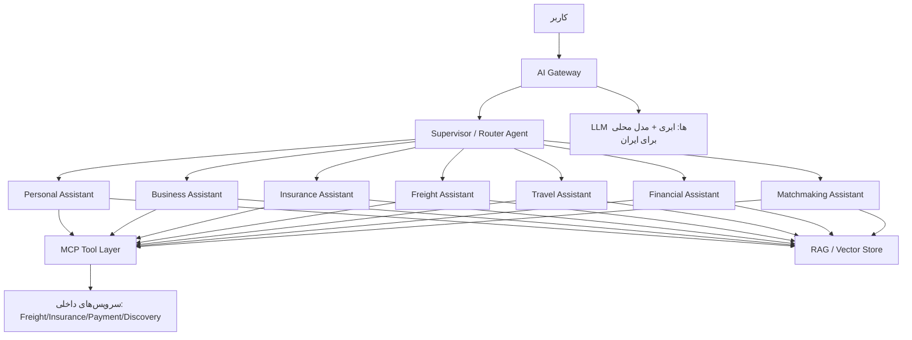
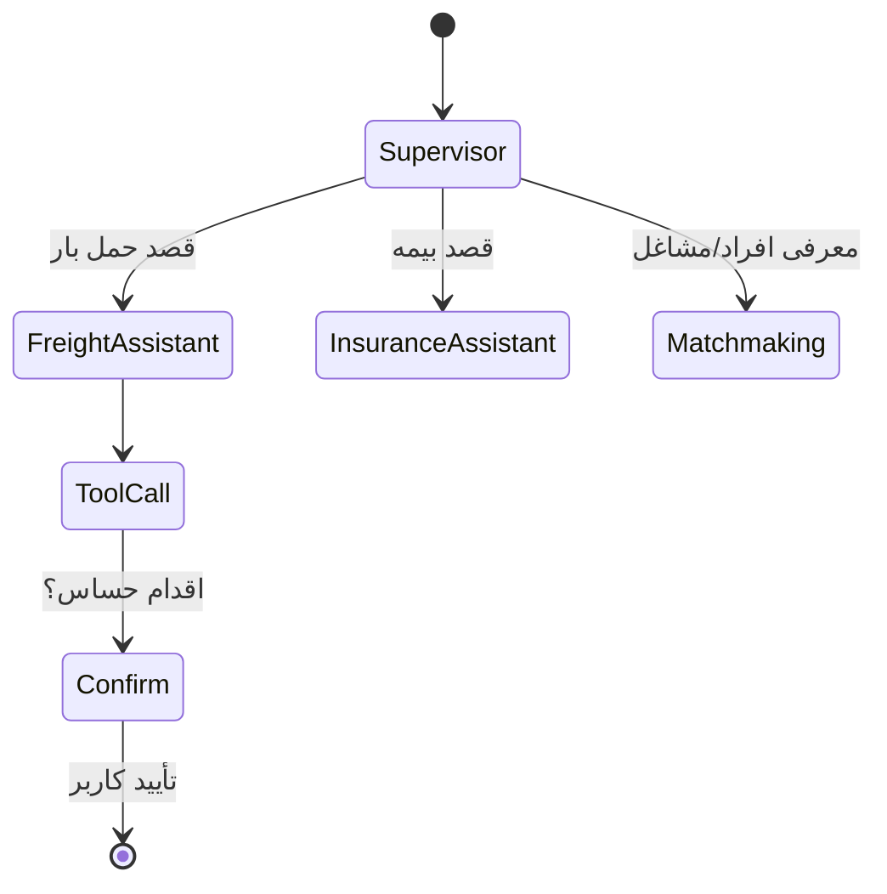

# سند ۸ — معماری هوش مصنوعی (AI Architecture)
**فاز ۸** · Dilix v1.0

---

## ۱. چشم‌انداز: Earth AI

یک سیستم **چندعاملی (Multi-Agent)** که هر کاربر را در نقشِ خودش همراهی می‌کند و افراد/مشاغل را به هم معرفی می‌کند. ساخته‌شده روی **LangGraph** (orchestration)، **RAG** (دانش)، و **MCP** (اتصال ابزارها/سرویس‌ها).

---

## ۲. معماری کلان

---

## ۳. الگوی چندعاملی (LangGraph)

- **Supervisor Agent:** قصد کاربر را می‌فهمد و به agent تخصصی مسیر می‌دهد (یا چند agent را هماهنگ می‌کند).
- **Specialist Agents:** هرکدام prompt، ابزارها و دانش مخصوص خود.
- **Graph State:** حافظه‌ی مکالمه + context کاربر (نقش، region، kyc) + نتایج ابزار.
- **Human-in-the-loop:** اقدامات حساس (پرداخت، صدور بیمه) نیاز به تأیید صریح کاربر دارند؛ AI خودش تراکنش مالی را نهایی نمی‌کند.

---

## ۴. MCP Tool Layer

هر قابلیت پلتفرم به‌صورت **ابزار MCP** در دسترس agentها:

| ابزار | کار |
|---|---|
| `freight.search` / `freight.post` | یافتن/ثبت بار |
| `insurance.quote` | استعلام بیمه |
| `payment.create_order` | ایجاد سفارش پرداخت (نیاز تأیید کاربر) |
| `discovery.find_people` | یافتن افراد/مشاغل برای Matchmaking |
| `reputation.get` | امتیاز اعتماد |
| `profile.get` | اطلاعات (با رعایت ACL/حریم خصوصی) |

> ابزارها از همان AuthZ (RBAC/ABAC) عبور می‌کنند؛ AI نمی‌تواند کاری فراتر از مجوز خود کاربر انجام دهد.

---

## ۵. RAG و دانش

- **منابع:** راهنمای محصول (`.noqte/context`)، قوانین حمل/بیمه، FAQ، اسناد ارائه‌دهندگان.
- **Vector DB** با ACL سطح-سند (هر کاربر فقط دانش مجاز خود).
- **Embeddingها** per-region (data residency).
- **Hybrid search** (vector + keyword/Elasticsearch).
- **Grounding اجباری** برای پاسخ‌های مالی/بیمه/حقوقی (با citation) تا از hallucination پرهیز شود.

---

## ۶. مرز حریم خصوصی و E2EE (هماهنگ با سند ۶)

- AI **هرگز** به پیام‌های E2EE کاربر-به-کاربر دسترسی ندارد.
- چت با AI در کانال جداگانه‌ی غیر-E2EE با **رضایت صریح**.
- داده‌ی ورودی به LLM ابری minimize و در صورت نیاز redaction (PII masking).
- برای ایران: امکان استفاده از **مدل محلی/میزبانی داخلی** برای داده‌ی حساس (به‌دلیل تحریم و residency).

---

## ۷. Matchmaking Assistant (نقش مکمل)

- بر اساس پروفایل (opt-in)، علایق، شغل، موقعیت، و reputation، افراد/مشاغل مرتبط را پیشنهاد و **معرفی** می‌کند.
- فقط روی کاربرانِ `discoverable`؛ مختصات دقیق فاش نمی‌شود.
- می‌تواند نقش «همراه اجتماعی» برای افراد عادی ایفا کند (در چارچوب ایمنی و ضدسوءاستفاده).

---

## ۸. عملیات و کیفیت AI (LLMOps)

- **Guardrails:** فیلتر محتوا، تشخیص prompt-injection، محدودیت ابزار.
- **Evaluation:** مجموعه‌ی تست برای هر agent، سنجش grounding و دقت.
- **Observability:** trace هر مرحله‌ی graph، هزینه‌ی توکن، latency.
- **Fallback:** اگر LLM ابری در دسترس نبود (ایران)، سوییچ به مدل محلی.
- **Caching** پاسخ‌های پرتکرار و embeddingها.
