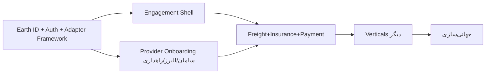

# سند ۹ — برنامه‌ی پیاده‌سازی (Implementation Plan)
**فاز ۹** · Dilix v1.0

---

## ۱. اصل اجرا

«**طراحی جامع، اجرای لایه‌ای**». ابتدا لایه ۰ و ۱ (پوسته‌ی جذب کاربر)، سپس لایه ۲ (Freight + Insurance + Payment با شرکای آماده)، سپس بقیه به‌صورت Adapter. هیچ کدی قبل از تأیید این معماری شروع نمی‌شود.

---

## ۲. رودمپ لایه‌ای (بدون تخمین زمان — ترتیب و milestone)

### Milestone 0 — پایه (Foundation)
- Mono-repo، CI/CD، K8s (Iran + Global)، observability، secrets.
- Earth ID + Auth + MFA + RBAC/ABAC + Event Backbone + Provider Adapter Framework (skeleton) + i18n.
- **خروجی:** کاربر می‌تواند ثبت‌نام/ورود کند؛ زیرساخت رویداد و adapter آماده است.

### Milestone 1 — Engagement Shell (موتور جذب کاربر)
- Messenger (E2EE، 1:1/گروه، فایل/ویس) + Realtime Gateway + تماس صوتی/تصویری (WebRTC).
- Social (پست/استوری/ریلز/کامنت/فید) + Media (MinIO).
- 3D Earth Discovery (opt-in، fuzzing، فیلترها).
- AI Assistant (Supervisor + Personal Assistant + MCP پایه).
- Growth & Incentives پایه (رفرال محدود + کش‌بک گره‌خورده به تراکنش).
- **خروجی:** محصول قابل‌عرضه برای جذب کاربر (MVP عمومی).

### Milestone 2 — Vertical اول (درآمد)
- Freight کامل: ثبت بار → تطبیق راننده → تأیید دوطرفه → بارنامه (Carrier/راهداری Adapter) → GPS → تحویل → تسویه.
- Payment Orchestration با **بانک سامان** (Escrow بانکی، پرداخت‌یاری شاپرک).
- Insurance با **بیمه البرز** (استعلام/صدور اختیاری همزمان با بارنامه + خسارت).
- Reputation (امتیازهای logistics/financial/trust).
- **خروجی:** اولین جریان درآمدی واقعی end-to-end.

### Milestone 3 — توسعه (Adapter-only)
- Financial کامل (چند ارائه‌دهنده)، Telecom/eSIM، Service Marketplace، Open API Marketplace عمومی.
- Membership (Walmart+) + Revenue-Share (Vanguard) + اتصال سرمایه‌گذاری به صندوق مجاز (BlackRock-style).
- Gamification کامل، Travel/Financial/Insurance Assistants.

### Milestone 4 — جهانی‌سازی
- راه‌اندازی ریجن بین‌المللی، onboarding شرکای روسیه/عمان/ترکیه، انطباق GDPR/محلی، چندارزی.

---

## ۳. وابستگی‌های بحرانی (Critical Path)

**وابستگی‌های بیرونی (بلاکر بالقوه):**
- قرارداد فنی + sandbox API از سامان، البرز، سازمان راهداری.
- مجوز پرداخت‌یاری (شاپرک) و ثبت کارگزاری بیمه.
- زیرساخت میزبانی داخلی (آروان و…) و استراتژی توزیع اپ (بازار/مایکت/PWA).

---

## ۴. ساختار تیم پیشنهادی

| تیم | تمرکز |
|---|---|
| Platform/Infra | K8s، CI/CD، مش، observability، multi-region |
| Identity & Security | Earth ID، Auth، RBAC/ABAC، E2EE، compliance |
| Engagement | Messenger، Social، Realtime |
| Earth & Discovery | نقشه 3D، geo، privacy |
| Verticals | Freight، Insurance، Payment، Adapterها |
| Growth | رفرال، rewards، membership |
| AI | Multi-agent، RAG، MCP، LLMOps |
| Mobile (Flutter) | اپ کاربر |
| Web (Next.js) | وب، Provider Portal، Admin |
| Provider Integrations | KYB، Adapterهای سامان/البرز/راهداری |
| QA / Security testing | تست، pen-test |
| Product/Legal/Compliance | رگولاتوری، قرارداد ارائه‌دهندگان |

---

## ۵. استک نهایی (تأییدشده)

- **Backend:** Python + FastAPI (+ gRPC داخلی)، LangGraph برای AI.
- **Frontend:** Flutter (موبایل/دسکتاپ)، Next.js (وب/PWA/پورتال‌ها).
- **Data:** PostgreSQL، Redis، Elasticsearch، MinIO، Vector DB.
- **Realtime:** WebSocket، WebRTC (SFU).
- **Messaging/Events:** Kafka یا NATS JetStream.
- **Infra:** Docker، Kubernetes، Service Mesh، OpenTelemetry/Prometheus/Grafana.
- **AI:** LLM ابری + مدل محلی (ایران)، RAG، MCP.

> سیاست بیلد: image build و بیلدهای سنگین فقط روی سرور SSH، نه داخل کانتینر توسعه.

---

## ۶. تعریف Done برای هر Milestone

- همه‌ی APIها مطابق contract (OpenAPI/AsyncAPI) + تست قرارداد.
- پوشش تست واحد/یکپارچه برای مسیرهای حساس.
- threat model + pen-test برای verticalهای مالی/بیمه.
- مستندسازی + خروجی observability + runbook.
- انطباق رگولاتوری تأییدشده توسط تیم legal.

---

## ۷. گام بعدی پس از تأیید این معماری

1. تأیید نهایی این ۱۰ سند توسط تو.
2. شروع **Milestone 0**: راه‌اندازی mono-repo، اسکلت سرویس‌های Core، Earth ID و Auth.
3. موازی: شروع مذاکرات فنی sandbox با سامان/البرز/راهداری.

> در صورت تمایل، می‌توانم این اسناد را به‌صورت فایل رسمی **Word / PDF** یا یک **ارائه‌ی PowerPoint** برای جلسه با شرکا هم خروجی بگیرم.
